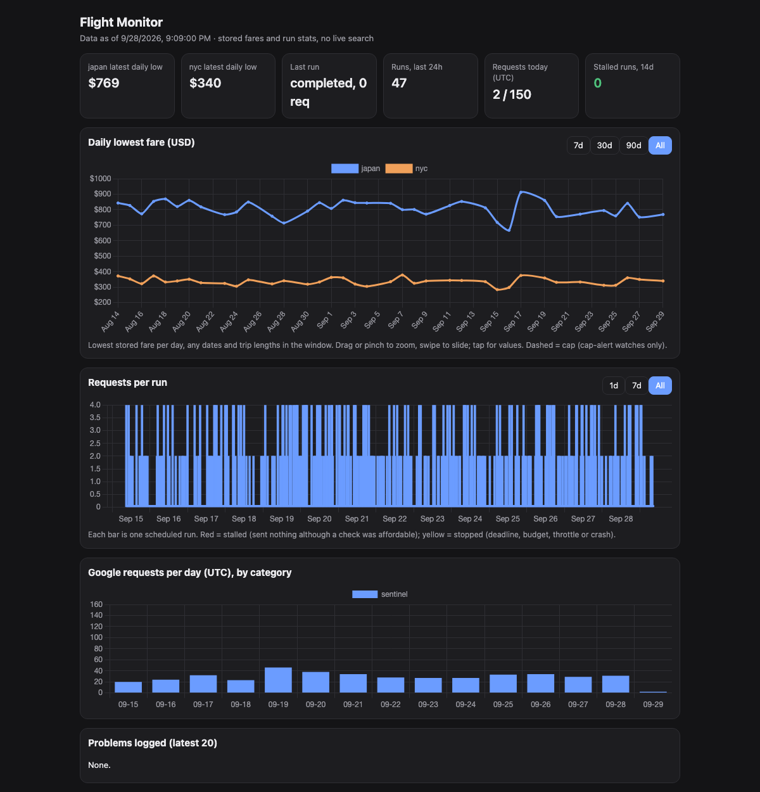

# Flight Monitor

A personal cheap-flight radar for trips from the San Francisco Bay Area (SFO / OAK / SJC). It watches round-trip fares to a handful of destinations, builds its own price history, and sends a weekly digest. Once enough history exists, it will also flag fares that are unusually cheap for their route.

This repository hosts the monitor's **dashboard page** only. The collector itself runs privately.

**[Open the dashboard with sample data →](https://yaozu789.github.io/flight-monitor/dashboard/#v1.5VvBbtswDP0XXecAFElbVr5jtyKHIA2wDlkWrGmHoci_T3KKwSKDYkAMi0mPfqQsiuQTJVl-c69u6Ru3PrqlQ8BuAXGB8SvwEuIXgCWAa9zv9XHzbfvslg8P7vv6sN67Zv-y262aB7f_s3l_WDXu8Otpk9Xe3rWy_vml_cKza3qmhnKrf2CbQAwC7FwTgtQMSbOVYJ_ALgow5ndCCSJkTQn6BPpegJR67_qmK8BkfOhboZmNZ9E7JjtDK5snO4PnUpOSSSH6UpOySVx0FBeQQegFiHlEXoB0qbn2fAK7DBa9JzA7GUBoZieD7CjmGAnQ-3M0i3d6VIGL52TwKDTb7CUxzJwMXRcEmOyMqXkJRhXiOMQ9tG3ZEeLZ-BLMIY4swGySeue760pwiLswCbOXhvxM5MhMkYSggJoQpNI8dUiImhC6eYoVEWlCEF8gBLVeE4LwAiEIWROCoNOEIA6aEIReE4LYa0KQj5oQYkRnQlBHmhAkYwWD8aAJQdBqQhC1mhAUek0IwlYTQjj5TAhi1oQgvkAI1XtOBuxZEwJjrwlBodWEoDZqQhB5TYjsZEUIkhwdQiyZlwmhPD_EvQVNiLOXVqfG_XrZg1vGyJ664WmoMNC4zc8fh932uH10DTeQXuALDP4Tu9QWr8DgCj2YeBzXvO8aH_DEfrHue0uYpXhMnS9z8ANvkJdgqI9aXK2VV7eYp_jJ_IfGaw9fMQ6eYX4GQ3M2G5rbpx5HrXpUa13Hhuqg9bpqfY05tR7foJ8t7VO40jh4hprME_uPZ8jJqes5T-wXrBQjnqHuww1ya-oaypVqPMyQQ3PMGzzDPDRH_rGhM1CeYb9vaR0xx34GDa3ruNIcBsZrIxo_r4M7Hi9Xsm-ONWutNcgcfsFK56d4g_vuOeZiMJ5_aHxvwIbOHiyt27HSGhjveB5CQ_uUqde7XOk7GN7JXY3Pdi8D76R2Y6V8RuPfEmp98wJD8xAaumdUa62Hhnw1dS3jSt8DwNB6kivdseEbnDfA0N4KDe11rd9VY0PzEBu6mwKGzqnR0Lkj3-AZCt7xeRPe4PkkGr_jhcbPNmvdBwFD37Hxzu-vrRr3fNjuH_NPrKP_sNLT83Z_fNpvd26JcGrG_2OVQh4LQykkHAt70ZLGwlgKuRsJEcRr-7HQC-HYIETRZ9GShDCMhfyRUHiIxkPB7iODhIcwjoXCQ-THQuEhPCXh9jU959_IVqe_)**

The sample data is synthetic and dated September 2026, so "last 24h" style cards drift as time passes.

## How the dashboard works

- **The page holds no data.** Each dashboard link carries its own snapshot in the URL fragment (`#v1.` + base64url, raw-deflate JSON). Browsers never send the fragment to a server, so GitHub Pages only ever serves the empty page.
- The collector builds a link from its local database on request, and each weekly digest includes one.
- The snapshot covers daily lowest fares, requests per scheduled run (stalls in red), daily request spend, and recent problems.
- **Strict by default:**
  - The Content-Security-Policy allows only same-origin scripts, and no network connections.
  - The chart libraries are vendored, with checksums in `dashboard/vendor/README.md`.
  - Fragment data is rendered with `textContent` only.

## How the monitor works

A small Python program, run every 30 minutes by a hosted agent. No server, no browser automation, no LLM in the data path.

- **Data source:** Google Flights through the open-source [fli](https://github.com/punitarani/fli) library, one grouped query per check (all origin and destination airports at once).
- **Where it looks:** fixed departure dates on a calendar grid, with trip lengths chosen per destination:
  - a near window (1–6 weeks out) for every destination
  - a long window (3–9 months out) for far-away destinations
  - Weekend trips are modelled as leaving Friday or Saturday and returning Sunday.
- **How often:** each date is rechecked only when it is due (every 48 h near, 72 h far), so the request rate follows actual need.
- **Polite by design:**
  - An atomic daily request budget with a staged ramp.
  - Every HTTP attempt is counted before it is sent.
  - One request at a time.
  - Throttle and CAPTCHA detection with persisted backoff.
- **Alerts, in phases:**
  - First it only collects prices.
  - Then a Monday digest of the cheapest fare per departure window.
  - Later "unusually cheap" alerts: a fare well below its route's recent median, rechecked live on the exact same itinerary before anyone is notified.
- **Health:** a dead-man heartbeat (healthchecks.io), stall detection, and a coverage report that gates each budget increase.
- **Storage:** SQLite. The test suite runs offline against a fake transport.

## Scope

This is a personal tool, kept deliberately small and low-volume. If you want to query Google Flights from Python yourself, start from [fli](https://github.com/punitarani/fli) directly, and keep your request rate modest.
